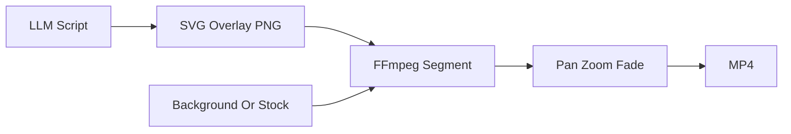

# 動画紙芝居感改善 設計指示書

## 背景

現行の補助金解説動画は、LLMが生成した台本をもとにSVGスライドを作成し、PNG化した静止画をFFmpegで数秒ずつ連結している。スライド内の情報設計は改善されたが、映像としては「1枚絵が切り替わる」構造のままで、紙芝居感が残っている。

## 現行課題

- セクションごとに生成されたoverlay PNGが、表示時間中ほぼ固定される。
- スライド間の切り替えが硬く、映像としての連続感が弱い。
- `hook`、`numbers`、`story` などのtype差分は見た目に反映されているが、動きの差分にはなっていない。
- Remotionへ移行すれば本格的なアニメーションは可能だが、Lambda/Chromium基盤が必要で導入コストが大きい。

## 改善方針

Remotion移行の前段階として、現行のFFmpegベースの構成を維持しながら、`filter_complex` の時間式で最低限のモーションを付ける。

対象は `src/lib/video/composeVideo.ts` の `composeEnhancedVideo()` と `createNewsSegment()`。スライド生成や台本生成の構造は変えない。

## type別演出

| type | motion | 目的 |
| --- | --- | --- |
| `hook` | 画面全体をゆっくりズームイン | 冒頭の止まり感を減らし、視線を中央へ集める |
| `problem` | overlayを軽く横移動しながら表示 | 課題カードが入ってくる印象を作る |
| `solution` | 中央カードを緩やかに拡大 | 解決策への切り替わりを強調する |
| `numbers` | 数字パネルを強調するズーム | 金額・補助率のインパクトを出す |
| `story` | 背景パン量を強め、左右分割の停滞感を減らす | Before/Afterの流れを感じさせる |
| `cta` | 中央寄せのゆっくりズーム + フェード | 最後の誘導を自然に見せる |

## 実装ルール

- 文字の可読性を優先し、強い移動や回転は使わない。
- ズーム量は最大でも約3%程度に抑える。
- 各セグメントの先頭と末尾に短いフェードを入れる。
- 既存のS3保存、スラッグ維持、台本生成、TTSの流れは変更しない。
- 通常の `slides` provider には影響させず、`enhanced` provider のみを対象にする。

## 今回やらないこと

- Remotion移行
- CSSアニメーション
- 数字カウントアップ
- テキストの1行ずつの段階表示
- BGM/SE追加

## 完了条件

- 生成動画でスライド内の静止感が緩和されている。
- スライド切り替えが急な静止画切替に見えにくい。
- 文字の可読性が落ちていない。
- 既存動画を再生成してもスラッグが変わらない。
